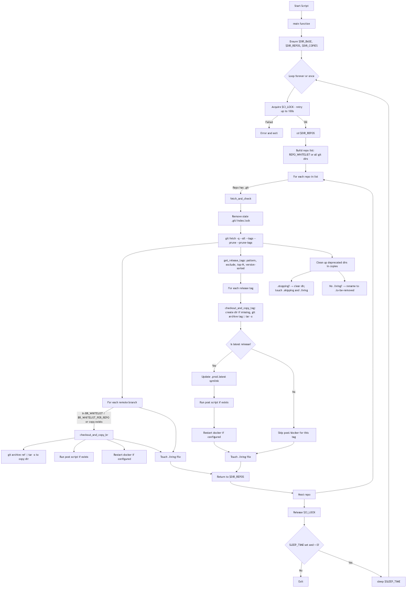
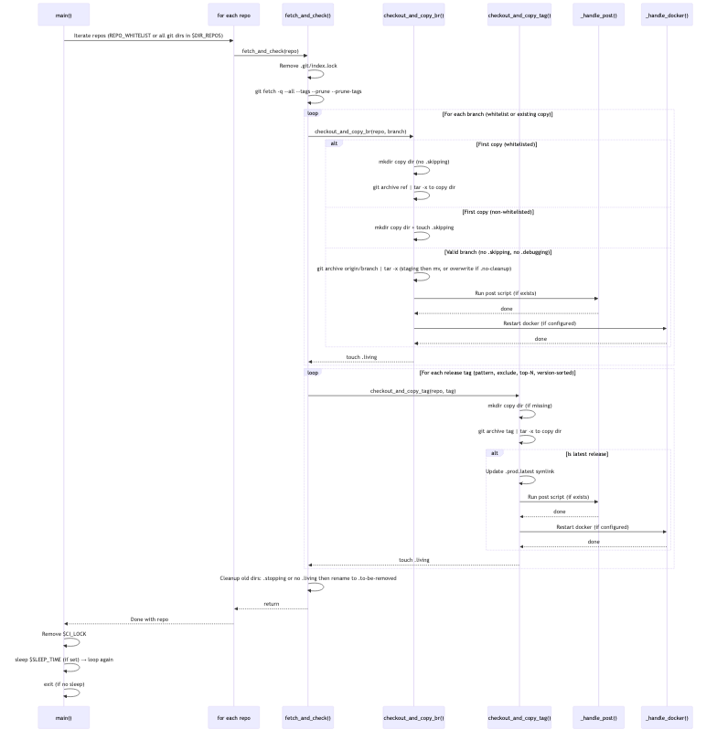

# Git Supervisor — monitor git repos and deploy to working environments

## Contents

- supervisor: central supervisor to control all remote hosts and repos, including a built-in GitHub webhook server (`hook` subcommand)
- `src/check-push.sh`: **main** logic of the engine, can be called by web hook or by timer loop
  check-push.sh shell script to have one-shot check.

## Download released binaries

Pre-built **git-supervisor** binaries are published on [GitHub Releases](https://github.com/jfding/git-supervisor/releases) for:

- **Linux** (x86_64): `git-supervisor-x86_64-unknown-linux-gnu-<tag>.tar.gz`
- **macOS** (Apple Silicon): `git-supervisor-aarch64-apple-darwin-<tag>.tar.gz`

**macOS:** If the binary is blocked or you see a security warning, clear extended attributes once after download:

```bash
xattr -c git-supervisor
```

## Usage

### Run by Docker

- Sample settings in docker-compose.yml in the code tree.
- Volume <work> to store all the data: git_repos, (code)copies, scripts.
- Volumn <keys> to store the ssh keys to access github.com repos.

### Web hook for github repos

The `hook` subcommand starts a GitHub webhook server (default port `:9870`). It verifies push event signatures and triggers a check-push cycle on all configured hosts.

```bash
# Using supervisor config (triggers watch-once on push events)
/git-supervisor hook --secret MY_SECRET

# Using an external script (backward-compatible with legacy gh-webhook)
/git-supervisor hook --secret MY_SECRET --script /scripts/check-push.sh

# Custom port; secret from env var
GITHUB_WEBHOOK_SECRET=MY_SECRET /git-supervisor hook --port 8080
```

It's the default command entry for docker image, will listen on :9870 port.

### Run git-supervisor cli to watch status of repos on multiple hosts

If want to run a timer loop instead of web-hook, need to:

- Specify the **command** as `/git-supervisor watch ...` for docker-run
- Additional args can be appended in above line
- To prepare the proper defined **deployments.yaml** for the target repos

### (Legacy way) Run original shell script loop to check status of repos on local

- Must set SLEEP_TIME env for docker-run, to specify the timeout values(seconds)
- Specify the **command** as `/srcripts/check-push.sh` for docker-run
- If no SLEEP_TIME env, the script will be run as one-shot checking.

#### ENV Configuration (check-push.sh)

- **BR_WHITELIST**: Space-separated branch names to track and copy by default (e.g. `main master dev`). Override via env; default in script: `main master dev test alpha`. Whitelisted branches get their copy dir created and populated on first run; other branches are only tracked if a copy dir already exists (and then start with a `.skipping` flag until you remove it).

#### Init working git repos manually (without git-supervisor cli)

In HOST, under the path *<work-volume>/git_repos/*, just use the regular `git clone` the target repos.

## Development

### Design

The logic in the central check-push.sh script:

**Flow**



**Sequence**



### Versioning

The project uses a single source of truth for version: the **`VERSION`** file at the repo root (e.g. `1.0.0`).

- **Scripts**: Run `check-push.sh --version` / `-V` prints it. In the Docker image, `VERSION` is copied to `/scripts/VERSION`.
- **gh-webhook** (legacy Python): Reads version from `/scripts/VERSION` at runtime. `GET /version` returns `{"version": "1.0.0"}`; webhook responses include `version` when available.
- **supervisor** (Rust): Build reads `VERSION` from the repo root and sets the binary version; `supervisor --version` shows it. The `hook` subcommand serves `GET /version` and includes `version` in webhook responses. If `VERSION` is missing, `Cargo.toml` package version is used.

To set the version everywhere (e.g. for a release), run:

```bash
./scripts/set-version.sh 1.2.3
```

This updates `VERSION`, `supervisor/Cargo.toml`, and `gh-webhook/pyproject.toml`.

### how to test

- first time to launch all tests: `./tests/launch-testing.sh`
- if testing env is ready, to run: `./tests/scripts/test-check-push.sh`
- to clean up test env, to run: `./tests/cleanup-test.sh`

After everytime to run the test scripts, the results can be checked in `./tests/work.test/copies/`
