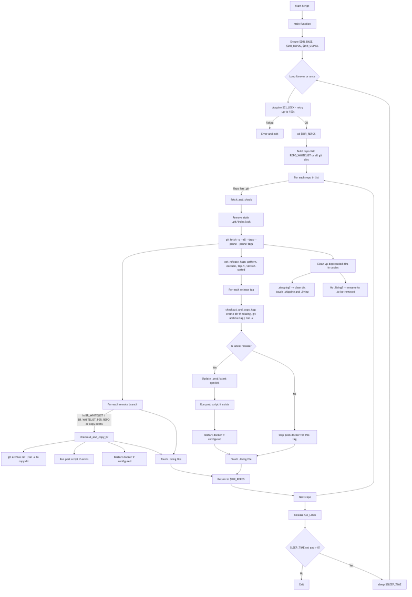
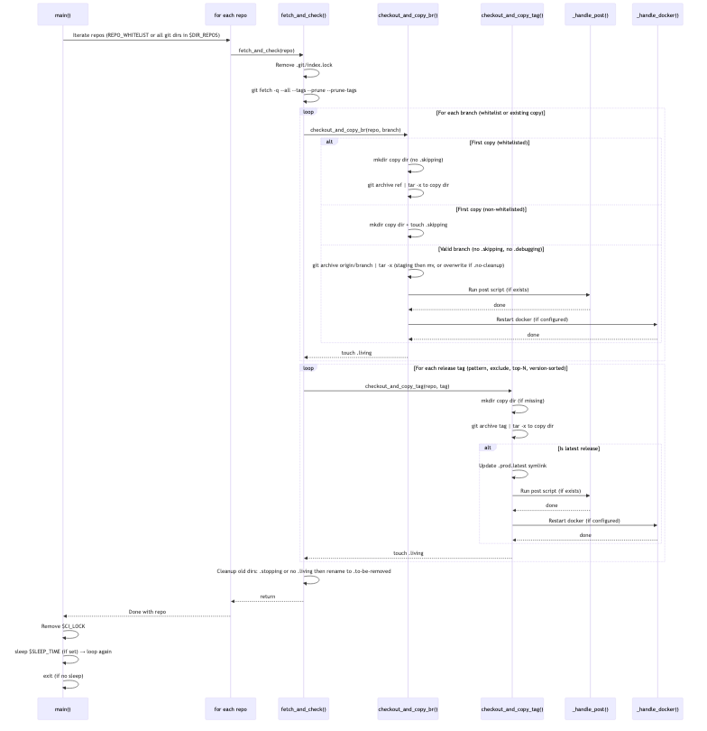

# Git Supervisor — monitor git repos and deploy to working environments

git-supervisor: central controller to manage git repos deployments on remote hosts.

This cli tool will read a single YAML config and, for each configured remote host, creates dirs and prepares git repos (clone or fetch) over SSH.

## Download released binaries

Pre-built **git-supervisor** binaries are published on [GitHub Releases](https://github.com/jfding/git-supervisor/releases) for:

- **Linux** (x86_64): `git-supervisor-x86_64-unknown-linux-gnu-<tag>.tar.gz`
- **macOS** (Apple Silicon): `git-supervisor-aarch64-apple-darwin-<tag>.tar.gz`

**macOS:** If the binary is blocked or you see a security warning, clear extended attributes once after download:

```bash
xattr -c git-supervisor
```

## YAML config schema

- **Top level:** `defaults` (optional), `repos` (optional), `hosts` (required).
- **Defaults:** `dir_base`, `branches`, optional `log-level` (passed to the remote script as `LOGLEVEL`; script default 2 when omitted).
- **Repos:** map of repo name → definition (`git_url` only). Hosts reference these by name. Branches are not set here.
- **Per host:** `ssh_target` (e.g. `user@host`), optional `ssh_port`, `ssh_identity_file`, `dir_base`, optional `release_count`, optional `release_tag_pattern`, optional `release_tag_exclude_pattern`; `repos`: list of repo names or `{ name, branches? }` entries. Branches are configured only here (per host, per repo). When set, `release_count` is passed as env `RELEASE_TAG_TOPN` (script default 4). When set, `release_tag_pattern` and `release_tag_exclude_pattern` are passed as `RELEASE_TAG_PATTERN` and `RELEASE_TAG_EXCLUDE_PATTERN` (ERE; script default pattern: `^v[0-9Q.]+$`).

Example:

```yaml
defaults:
  dir_base: /work
  branches: [main, master]
  log-level: 2

repos:
  webapp:
    git_url: git@github.com:org/webapp.git
  api:
    git_url: git@github.com:org/api.git

hosts:
  app-server:
    ssh_target: deploy@app-server.example.com
    ssh_identity_file: ~/.ssh/deploy_key
    release_count: 8    # optional, default 4
    release_tag_pattern: "^v[0-9]+\\.0$"      # optional; passed as RELEASE_TAG_PATTERN
    release_tag_exclude_pattern: "^v0\\."     # optional; passed as RELEASE_TAG_EXCLUDE_PATTERN
    repos:
      - webapp
      - name: api
        branches: [main, release]
```

## Usage

```bash
# Check config, SSH/git connectivity, and repo existence on remotes
git-supervisor check [--config deployments.yaml]

# Prepare remotes (create dirs, ensure repos) then run check-push on each host in a loop
git-supervisor watch [--config deployments.yaml] [--interval SECS] [--timeout SECS] [-I | --ignore-missing]
                     [--webhook-secret SECRET] [--webhook-port PORT]
```

- Config is an optional argument to each subcommand; default: `deployments.yaml`.
- **check**: load and validate the config, then for each host verify SSH/git is available and that each configured repo directory exists under `dir_repos` with a `.git` directory.
- **watch**: first prepares each remote (create dirs, init empty repos by cloning when missing unless `-I`/`--ignore-missing`). Then, on the supervisor machine, it polls upstream refs for all configured repos. It only runs remote `check-push` on hosts whose configured repos have upstream changes (first round always runs on all hosts). `--interval` (default 120) controls polling cadence, optional `--timeout` stops after SECS, `-I`/`--ignore-missing` skips cloning (only create dirs; missing repos are ignored). Run until Ctrl+C if no timeout.
- Remotes must have **SSH** access (key-based) and **git** installed. For local hosts (`localhost`, `127.0.0.1`, `::1`, including forms like `user@localhost`), supervisor runs commands directly on the local machine and does not require an SSH daemon.

### GitHub Webhook settings

Use `watch` with `--webhook-port` and a secret (`--webhook-secret` or `GITHUB_WEBHOOK_SECRET`).

```bash
# Watch loop + webhook server on :9870
git-supervisor watch --webhook-port 9870 --webhook-secret MY_SECRET

# Secret from env var
GITHUB_WEBHOOK_SECRET=MY_SECRET git-supervisor watch --webhook-port 8080
```

If `--webhook-port` is set without a secret, the command exits with an argument error.

### Local mode (no deployments.yaml)

When `watch` cannot find a config file (`--config`, `~/.config/git-supervisor/deployments.yaml`,
or `./deployments.yaml`), it automatically falls back to local mode:

- Runs embedded `check-push.sh` locally (no SSH)
- Reuses `watch` flags: `--interval` and `--timeout`
- `--interval 0` means run once and exit
- Inherits `check-push.sh` env vars from current process (for example `DIR_BASE`, `BR_WHITELIST`, `LOGLEVEL`)
- If `REPO_WHITELIST` is exported but empty, it is treated as unset

```bash
# Local one-shot run (no config file present)
git-supervisor watch --interval 0

# Local loop every 60s, stop after 10 minutes
git-supervisor watch --interval 60 --timeout 600
```

### Run by Docker

- Sample settings in docker-compose.yml in the code tree.
- Volume `<work>` to store all the data: git_repos, (code)copies, scripts.
- Volume `<keys>` to store the ssh keys to access github.com repos.

### Docker restart and pre/post hook jobs

When a copy path has a docker restart config file (`*.docker`), `check-push.sh` can run optional hook jobs around restart:

- **Pre hook**: `*.docker.pre` runs before `docker restart`
- **Post hook**: `*.docker.post` runs after a successful `docker restart`

Examples:

- Branch copy: `/work/copies/webapp.main.docker` + optional `/work/copies/webapp.main.docker.pre` / `/work/copies/webapp.main.docker.post`
- Latest release copy: `/work/copies/webapp.prod.docker` + optional `/work/copies/webapp.prod.docker.pre` / `/work/copies/webapp.prod.docker.post`

Hook job scripts are executed with `bash`, from the copy directory as working directory, and receive:

- `DOCKER_HOOK_STAGE` (`pre` or `post`)
- `DOCKER_NAME` (container name from `*.docker`)
- `DOCKER_HOOK_FILE` (resolved hook script path)

### (Legacy) Run original shell script loop to check status of repos on local

- Must set `SLEEP_TIME` env for docker-run, to specify the timeout values (seconds)
- Specify the **command** as `/scripts/check-push.sh` for docker-run
- If no `SLEEP_TIME` env, the script will be run as one-shot checking.
- ENV **BR_WHITELIST**: Space-separated branch names to track and copy by default (e.g. `main master dev`). Override via env; default in script: `main master dev test alpha`. Whitelisted branches get their copy dir created and populated on first run; other branches are only tracked if a copy dir already exists (and then start with a `.skipping` flag until you remove it).

## Development

### Design

The logic in the central check-push.sh script:

**Flow**



**Sequence**



### Versioning

The project uses a single source of truth for version: the **`VERSION`** file at the repo root (e.g. `1.0.0`).

- **Scripts**: Run `check-push.sh --version` / `-V` prints it. In the Docker image, `VERSION` is copied to `/scripts/VERSION`.
- **supervisor** (Rust): Build reads `VERSION` from the repo root and sets the binary version; `git-supervisor --version` shows it. If `VERSION` is missing, `Cargo.toml` package version is used.

To set the version everywhere (e.g. for a release), run:

```bash
./scripts/set-version.sh 1.2.3
```

This updates `VERSION`, `Cargo.toml`, etc.

### Testing

- Run `cargo teset` to run the basic test cases
- And `cargo test -- --ignored` to run embedded shell script integration testings
- Or to run the shell script testing directly:
    - First time to launch all tests: `./core/tests/launch-testing.sh`
    - If testing env is ready, to run: `./core/tests/scripts/test-check-push.sh`
    - To clean up test env, to run: `./core/tests/cleanup-test.sh`
